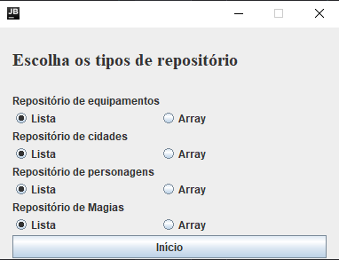
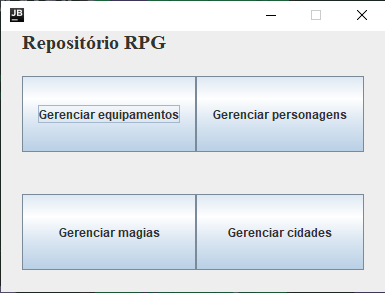
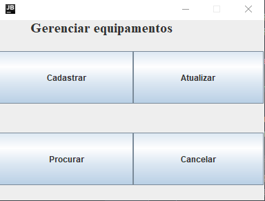
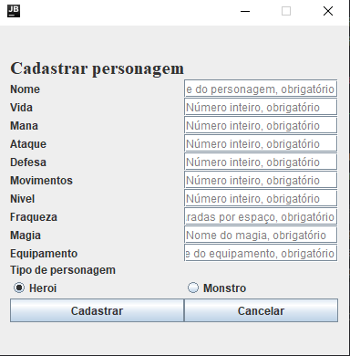
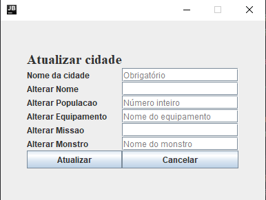
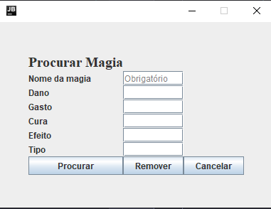

# Projeto-IF669

> RPG Companion

### Integrantes
- João Mazzarolo - Cidade
- José Danilo  - Personagem
- Julio Vinícius - Magia
- Thiago Henrique - Equipamento

## Desenvolvimento
-------------

### Classes bases:
- [x] [Personagem](./src/ClassesBasicas/Personagem.java)
- [x] [Herói](./src/ClassesBasicas/Heroi.java)
- [x] [Monstro](./src/ClassesBasicas/Monstro.java)
- [x] [Equipamento](./src/ClassesBasicas/Equipamento.java)
- [x] [Magia](./src/ClassesBasicas/Magia.java)
- [x] [Cidade](./src/ClassesBasicas/Cidade.java)

### Repositórios:
 - [x] de Personagens
    - [x] [Interface](./src/Repositorios/RepositorioPersonagem.java)
        - [x] [Array](./src/Repositorios/RepositorioPersonagemArray.java)
        - [x] [Lista](./src/Repositorios/RepositorioPersonagemLista.java)

 - [x] de Equipamentos
    - [x] [Interface](./src/Repositorios/RepositorioEquipamento.java)
        - [x] [Array](./src/Repositorios/RepositorioEquipamentoArray.java)
        - [x] [Lista](./src/Repositorios/RepositorioEquipamentoLista.java)
 - [x] de Magias
    - [x] [Interface](./src/Repositorios/RepositorioMagia.java)
        - [x] [Array](./src/Repositorios/RepositorioMagiaArray.java)
        - [x] [Lista](./src/Repositorios/RepositorioMagiaLista.java)
 - [x] de Cidades
    - [x] [Interface](./src/Repositorios/RepositorioCidade.java)
        - [x] [Array](./src/Repositorios/RepositorioCidadeArray.java)
        - [x] [Lista](./src/Repositorios/RepositorioCidadeLista.java)

### Excecoes:
- [x] Personagem
    - [x] [Não existe](./src/Excecoes/PersonagemJaExisteException.java)
    - [x] [Já existe](./src/Excecoes/PersonagemNaoExisteException.Jáva)
    - [x] [Entrada Inválida](./src/Excecoes/EntradaInvalidaException.java)
- [x] Equipamento
    - [x] [Já cadastrado](./src/Excecoes/EquipamentoJaCadastradoException.java)
    - [x] [Não encontrado](./src/Excecoes/EquipamentoNaoEncontradoException.java)
    - [x] [Inventário Cheio](./src/Excecoes/InventarioCheioException.java)
- [x] Magia
    - [x] [Já existe](./src/Excecoes/MagiaJaExisteException.java)
    - [x] [Não encontrada](./src/Excecoes/MagiaNaoEncontradoException.java)
- [x] Cidade
    - [x] [Já existe](./src/Excecoes/CidadeJaExisteException.java)
    - [x] [Não Existe](./src/Excecoes/CidadeNaoExisteException.java)
    - [x] [Cidade Inválida](./src/Excecoes/CidadeInvalidaException.java)
    - [x] [Missão Inválida](./src/Excecoes/MissaoInvalidaException.java)
    - [x] [População Inválida](./src/Excecoes/PopulacaoInvalidaException.java)

### Classe abstrata:
- [x] [Personagem](./src/ClassesBasicas/Personagem.java)
 - [x] [Heróis](./src/ClassesBasicas/Heroi.java)
 - [x] [Monstros](./src/ClassesBasicas/Monstro.java)

### Fachada de Negócio
- [x] [Personagem](./src/FachadasNegocio/FachadaPersonagem.java)
- [x] [Equipamento](./src/FachadasNegocio/FachadaEquipamento.java)
- [x] [Cidade](./src/FachadasNegocio/FachadaCidade.java)
- [x] [Magia](./src/FachadasNegocio/FachadaMagia.java)

### Fachada Geral, Teste e Interface de Usuário
- [x] [Fachada Geral](./src/FachadaGeral/FachadaGeral.java)
- [x] [Classe Teste](./src/Tester.java)
- [x] [Interface de Usuário](./src/InterfaceUsuario.java)
- [x] [Interface Gráfica](./src/InterfaceUsuario.java)

### Comentado
:white_check_mark::white_check_mark::white_check_mark::white_check_mark::white_check_mark::white_check_mark::white_check_mark::white_check_mark::white_check_mark::white_large_square:
